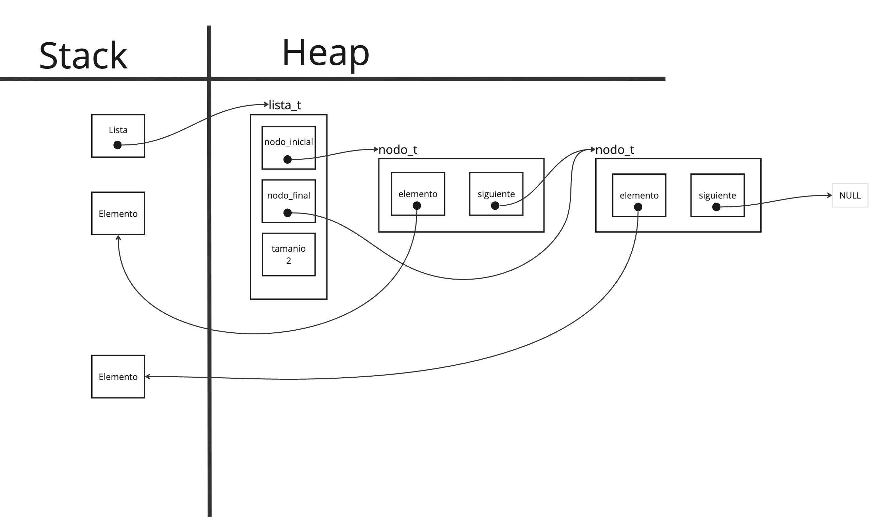
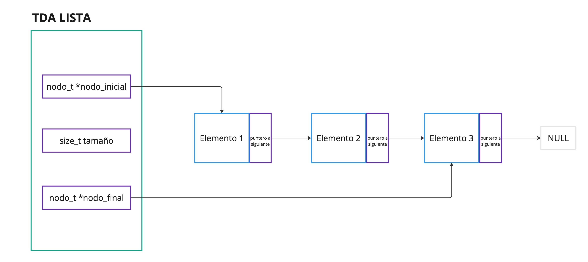
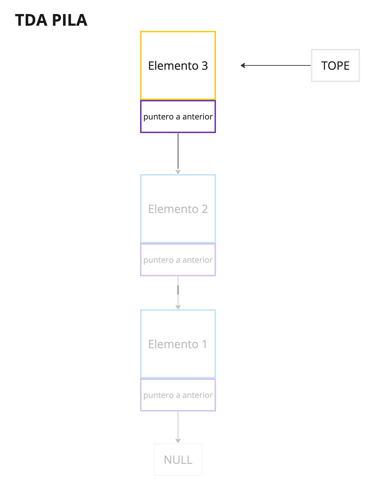
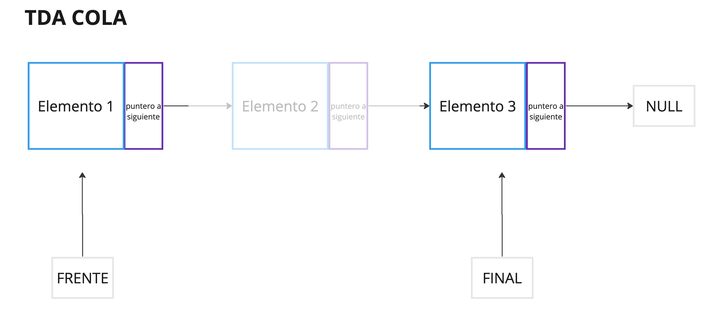

<div align="right">

</div>

# TDA LISTA
## Alumno: Lucas Martín Areco Gonzalez - 111203 - lareco@fi.uba.ar

- Para compilar:

```bash
make pruebas_alumnno
```

- Para ejecutar:

```bash
./pruebas_alumno
```

- Para ejecutar con valgrind:
```bash
make valgrind-alumno
```

---

##  Funcionamiento

El TDA (Tipo de Dato Abstracto) lista en este trabajo se implementó utilizando nodos simplemente enlazados. Esta elección ofrece ventajas en el manejo de memoria, ya que no es necesario que la memoria reservada sea contigua.

La lista cuenta con un puntero al `nodo_inicial` y otro al `nodo_final`, lo que simplifica varias operaciones y facilita la reutilización de funciones para la implementación de pilas y colas. Además, cuenta con un contador tamanio que registra la cantidad de nodos o elementos presentes en la lista. Cada nodo contiene un puntero al elemento, que puede ser de cualquier tipo de dato, y un puntero al siguiente nodo.

Para comenzar a utilizar la lista, se invoca la función lista_crear(), que devuelve un puntero a la lista recién creada. Con la lista creada, se pueden utilizar el resto de las funciones disponibles para operar sobre ella, como inserción, eliminación, búsqueda, entre otras. Al finalizar el uso de la lista, se deben utilizar las funciones destructoras correspondientes.

El siguiente diagrama ilustra cómo quedaría la lista con dos nodos simplemente enlazados a nivel de memoria:

<div align="center">

</div>

Aprovechando la implementación del TDA lista y utilizando el casteo de punteros, se implementaron también los TDA lista y cola. Las funciones de lista relacionadas con la inserción y eliminación son principalmente utilizadas para las operaciones de apilar, desapilar, encolar y desencolar.

Además de la lista, se desarrollaron un iterador interno y un iterador externo. El iterador interno es una función integrada en el TDA lista que permite recorrer e iterar sobre la lista, aplicando una función a cada elemento. Por otro lado, el iterador externo es un TDA independiente que permite al usuario recorrer la lista utilizando las funciones propias del iterador externo.


## Respuestas a las preguntas teóricas

<div style="text-align: justify;">
Una lista es un tipo de dato abstracto que agrupa elementos en una secuencia. Cada uno de sus elementos conoce a su sucesor (menos el último) y, dependiendo el tipo de lista que se implemente, tambien puede conocer a su predecesor (excepto el primero). Lo importante aquí es que podemos ver todos los elementosde la lista y acceder a ellos. Al tener acceso a todos los elementos signfica que podemos utilizar cualquier elemento de forma individual y hasta podemos recorrerla en su totalidad de ser necesario. 
Algunas de las operaciones que se pueden realizar sobre este TDA son:

- Crear
- Destruir
- Insertar en cualquier posición
- Eliminar en cualquier posición
- Verificar si esta vacía
- Leer un elemento en cualquier posicion.
</div>
<div align="center">

</div>

<div style="text-align: justify;">
Una pila es una tipo de dato que agrupa elementos bajo la política de salida LIFO (Last In, First Out), es decir, el último elemento que agregamos
va a ser el primero en salir. Además, siempre vamos a tener referencia y un rápido acceso al último elemento agregado que lo llamaremos tope. El resto de los elementos de la pila son desconocidos y no tenemos forma de acceder a ellos sin utilizar el tope. De esta forma, cada vez que se apila o se desapila un elemento, el tope se va a actualizar. 
Algunas operaciones que se pueden aplicar sobre la pila son:

- Crear
- Destruir
- Leer el tope
- Insertar elemento (actualiza tope)
- Verificar si esta vacía
- Quitar elemento (actualiza tope)
</div>
<div align="center">

</div>

<div style="text-align: justify;">
Una cola es un tipo de dato que agrupa elementos bajo la política de salida FIFO (First In, First Out), es decir, el primer elemento que agregamos va a ser el primeroen salir. De esta forma, encolamos elementos por un extremos y los desencolamos por el otro extremo. Además, siempre vamos a tener referencia del primer elemento que llamaremos frente y del ultimo elemento de la cola que llamaremos final. El resto de los elementos de la cola son desconocidos y no podemos acceder directamente a ellos. 
Algunas operaciones que se pueden realizar sobre este TDA son:

- Crear
- Encolar (se hace por el final)
- Desencolar (se hace por el frente)
- Leer frente
- Verificar si esta vacía
- Destruir
</div>
<div align="center">

</div>


___
#### Complejidades de las operaciones de una lista según la implementacion


##### Lista simplemente enlazada

- Insertar al inicio: O(1) Se inserta directamente al inicio de la lista.
- Obtener al inicio: O(1) Se accede directamente al primer elemento de la lista.
- Eliminar al inicio: O(1) Se eliminar directamente el primer elemento de la lista
###
- Insertar al medio: O(n) Se requiere encontrar el nodo anterior a la posición deseada, lo que implica recorrer la lista.
- Obtener al medio: O(n)  Se necesita recorrer la lista para encontrar el nodo deseado.
- Eliminar al medio: O(n) Se debe encontrar el nodo a eliminar recorriendo la lista.
###
- Insertar al final: O(1)  Se inserta directamente al final de la lista.
- Obtener al final: O(1)   Se accede directamente al último elemento de la lista.
- Eliminar al final: O(n)  Se debe encontrar el penúltimo nodo recorriendo la lista para luego eliminar el último.


##### Lista doblemente enlazada

- Insertar al inicio: O(1) Se inserta directamente al inicio de la lista.
- Obtener al inicio: O(1)  Se accede directamente al primer elemento de la lista.
- Eliminar al inicio: O(1) Se elimina directamente el primer elemento de la lista.
###
- Insertar al medio: O(n) Se requiere encontrar el nodo en la posición de inserción deseada.
- Obtener al medio: O(n)  Se necesita recorrer la lista para encontrar el nodo deseado.
- Eliminar al medio: O(n) Se debe encontrar el nodo a eliminar recorriendo la lista.
###
- Insertar al final: O(1)  Se inserta directamente al final de la lista.
- Obtener al final: O(1)   Se accede directamente al último elemento de la lista.
- Eliminar al final: O(1)  Se elimina directamente el último elemento de la lista.

##### Vector dinámico

- Insertar al inicio: O(n) Se necesita redimensionar el espacio de memoria y desplazar los elementos.
- Obtener al inicio: O(1) Se accede directamente al primer elemento del vector. Se deben desplazar los elementos hacia la izquierda.
- Eliminar al inicio: O(n) Se deben desplazar los elementos hacia la izquierda.
###
- Insertar al medio: O(n)  Se recorre el vector para desplazar los elementos y hacer espacio para la inserción.
- Obtener al medio: O(1)  Se accede directamente al elemento deseado.
- Eliminar al medio: O(n) Se recorre el vector para desplazar los elementos y eliminar el elemento deseado.
###
- Insertar al final: O(n) En el peor de los casos, se debe redimensionar y desplazar los elementos.
- Obtener al final: O(1)  Se accede directamente al último elemento del vector.
- Eliminar al final: O(1) Se elimina directamente el último elemento del vector.

___
### Complejidad de las operaciones implementadas en pila y cola

Las operaciones más destacadas en cuanto al manejo de complejidad en la pila y cola son apilar, desapilar, encolar y desencolar, respectivamente, debido a su implementación basada en el TDA lista. El resto de las operaciones, tanto de la pila como de la cola, tienen complejidad O(1), ya que no necesitan recorrer la estructura, a excepción de las funciones destructoras.

```c
pila_t *pila_apilar(pila_t *pila, void *elemento)
{
	return (pila_t*)lista_insertar_en_posicion((lista_t*)pila, elemento, 0);
}
```
Esta función tiene complejidad O(1), ya que se inserta en la posición 0 de la pila, es decir, en el tope. No se recorren los nodos, solo se cambia la referencia al tope. Por lo tanto, el nodo inicial es el tope de la pila.
```c
void *pila_desapilar(pila_t *pila)
{
	return (pila_t*)lista_quitar_de_posicion((lista_t*)pila, 0);
}
```
La complejidad es O(1) debido a que se quita el nodo en la posición 0 de la pila, es decir, se desapila el nodo tope. De nuevo, no recorremos los nodos, solo reasignamos la referencia de tope al nodo siguiente.
```c
cola_t *cola_encolar(cola_t *cola, void *elemento)
{
	return (cola_t*)lista_insertar((lista_t*)cola, elemento);
}
```
La complejidad es O(1) porque al encolar en el final y tener referencia al nodo final con esta implementación, no es necesario recorrer toda la cola para insertarlo.
```c
void *cola_desencolar(cola_t *cola)
{
	return (cola_t*)lista_quitar_de_posicion((lista_t*)cola, 0);
}
```
La complejidad es O(1) ya que con esta implementación quitamos el primer nodo de la cola, es decir, quitamos el frente del cual tenemos una referencia. Solo reasignamos la referencia del frente al nodo siguiente. No es necesario recorrer la cola para desencolar.


